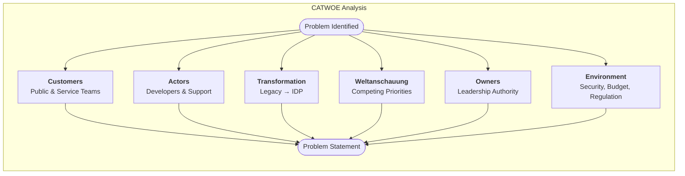

# Business Case <!-- 850 words: Root Cause Analysis ~450 + Solution & Goal ~400 -->

The client engagement is based on modernising how council services are developed, supported and delivered to the public.

The council recognises that legacy systems cannot be supported indefinitely and that new service delivey is hampered by outdated software development processes and tools.  

## Root Cause Analysis

While there are many ways to analyse the current state of the organisation (Phillips, 2026) SWOT, PESTLE etc. they have some limitations in this scenario.

SWOT looks at strengths and weaknesses but doesn't particularly handle conflicting perspectives. Pestle focuses on external inputs but we're delivering an internal transformation projects and Porter's Five Forces are primarily based on assumptions about a competitive market place, similar to SC Analysis.

CATWOE (Customers, Actors, Transformation, Worldview, Owners and Environment) analysis is geared towards "messy" problems (Umbrex 2026) in public bodies where stakeholders hold different opinions and priorities as to what's important.

CATWOE seeks to surface various stakeholders assumptions amid changing political, budgetary, technical and service delivery constraints.

<!-- 
Table Section: Root Cause Analysis (~450 words)
Problem Analysis, Business Transformation types, and Internal/External factors

This section should: 
 
●  Illustrate the context. 
●  State and discuss the problem. 
●  Include a problem statement that clearly defines the scope and focus of the business problem you will investigate.
●  Analyze business transformation types relevant to the problem.
●  Identify internal and external factors affecting the organization.
-->

### Problem Analysis

Applying the CATWOE framework, the transformation can be defined as moving from a set of legacy services to a platform that empowers faster service delivery, increases security and maintains trust in the organisation.

Stakeholders perceptions are based on their Wordlview, the W in CATWOE. 

For example, Developers see the issues in terms of technical debt, manual deployment processes and their challenges in supporting legacy software. 

Executives and Finance team members look through a lens of cost and sustainability as well as needing to react quickly to changing governmental policy.

Service managers would love the focus to be on customer experience and ease of support of the services as well as the security concerns that come with running something that's public facing. 

The problem statement must consider all of these perspectives: *The council's current software development practices are insufficiently standardised, poorly governed and difficult to secure, resulting in slow service delivery, escalating costs and exposure to risk.*

### Business Transformation Types

The T (Transformation) in CATWOE is driven by Development Process Improvements nested inside a wider Software Transformation Process. The first includes things like apopting CI/CD, automated testing and standardised environments on which the transformation process depends. In the book "Accelerate" (Forsgren, Humble and Kim, 2018) the authors show how mastering the fundamentals of automating deployments is a pre-requisite for transforming software delivery and then business outcomes. The continuous feedback loop which DevOps enables avoids what Humble and Farley (2010) term "integration hell" where chage freeze periods are required tp stabilize the environment. 

A foundational research discovery of the early DevOps papers (Dora.dev, 2021) was that Development teams return better business outcomes if they attack the following metrics.

* Change Lead Time - how fast does a change move from code check in to prod?
* Deployment Frequency - how often are changes deployed to production?
* Failed Deployment Recovery Time - if something does fail, for how long?
* Change Fail Rate - if a change is made, how often is it rolled back?
* Deployment Rework Rate - ratio of deployments that happen because of some unplanned issue in production

A useful way to summarise these points would be that as friction preventing the deployment of software reduces, the Development Process improves which inevitably accellerates Software Transformation, regardless of exactly what type it is.

<!-- 

Development Process Improvement	

- Development process improvement refers to changes in how software is planned, developed, tested, and deployed. This includes adopting new methodologies (like Agile or DevOps), implementing CI/CD pipelines, or improving quality assurance practices.

Software Transformation Process	

- Specifically focuses on changes or upgrades made to an organisation's software systems, applications, development processes, and technical infrastructure. This could involve modernising legacy systems, implementing new development methodologies, or adopting cloud-native architectures.
-->

### Internal Factors

The analysis here is all about who is impacted inside the organisation (Actors) versus those with authority over its direction (Owners). 

Let's consider Developers & Support staff as Actors they are subject to the competing priorities of the Owner class who are focussed on topics like budgets, political deadlines and internal politics. 

#### Adopting Best Practice

A developer might want to adhere ridgidly to best practice but can only really do so within the constraints set by *owners*. At the same time owners might insist on an unrealistic timeline to meet a political promise which risks introducting technical debt or security issues.

At some point one or both sides must compromise or deal with their own disappointment. It's important how these dynamics and challenges are discussed within the organisation.

### External Factors

The E (Environment) and C (Customers) part of CATWOE are both external factors. Environment encompasses Security around customer's data and the extremely negative impact should this be compromised. Finances of course drive everything from technology choices to staffing, engagement and what solutions are even worth considering.

#### Security

Security is a key external factor driving the adoption of a standard set of practices, development environments, deployment pipelines and other tools.

"Highly Significant" cyber attacks rose by 50% in 2025 (Booth, 2025) alongside the ramping up of malicious activity by criminals and even nation-state actors. 

Loss of confidence in the organisation should it become compromised impacts (Customer) trust and damages internal morale as well. 

#### Finances

Government finances with respect to IT projects have not been well managed historically. 

Most recently the National Savings & Investment (NS&I) transformation program is already £1.3 billion over budget and four years late (Clark, 2026) 

Taking steps within the STP to surface the costs of implementing and managing the various services must be part of the transformation project.

#### Customers

At the end of the day, if voters receive a sub-par service, council staff will receive negative feedback and there could be wider political fallout.

The public expect the same level of digital (self) service that they would get from an Amazon or any commercial organisation (REF: needed)

## Solution & Goal

We propose adopting Platform Engineering practices through the deployment of an Internal Developer Platform (IDP). 

Platform Engineering, according to juliakm (2023), is "a practice built up from DevOps principles that seeks to improve each development team's security, compliance, costs, and time-to-business value through improved developer experiences and self-service within a secure, governed framework. It's both product-based mindset shift and a set of tools and systems to support it."

<!--
Solution Consideration, SMART Goal Statement, and Justification

This section should:
●  Argue why the transformation solution is needed.  
●  Demonstrate the impact it could have on the organization.
●  Create a core goal (SMART Goal Statement) for the project.
●  Provide justification for the chosen solution.
-->

### Solution Consideration

We have to balance the competing forces highlighted by the various CATWOE elements, keep their disparate requirements in mind and report on progress across all of these axes.

Fig 1: Shows how the CATWOE framework pulls the individual narratives into a Smart Goal

### SMART Goal Statement

**Goal:** Within 12 months of start, enroll three project teams into the IDP, reduce change lead time by 50% using repeatable deployment pipelines and baseline their performance against the DORA metrics.

### Justification

An IDP becomes the vehicle each different stakeholder group can support, because it delivers what they're interested in at an individual level. 

Reducing change lead time reduces delays which lowers the cost of making changes. Improving service delivery improves (external) customer satisfaction and increases public perception that the organisation is succeeding in serving their needs.

The entire council will organisation will benefit because the organisational, process and technical changes needed to deliver an IDP mean that application modernisation, security and other internal/external concerns will be addressed.

<!--
RUBRIC C:
Shows foundational understanding with basic application of business analysis and project management principles.
Identifies and superficially analyses business problems, constructing a rudimentary business case.
Uses minimal research and references at least one organisational theory or best practice to illustrate effective teamwork in digital solutions.

RUBRIC B:
Clearly explains and effectively applies business analysis and project management principles in a systematic manner.
Analyses business problems with marked accuracy, developing a coherent business case informed by both professional and academic sources.
Demonstrates effective team collaboration strategies through an understanding of current practices.

RUBRIC A:
Strategically integrates business analysis and project management principles to address complex business challenges.
Critically analyses optimised solutions and a thorough business case.
Proposes ambitious organisational improvements with strategic planning to maximise team effectiveness and collaboration.
-->