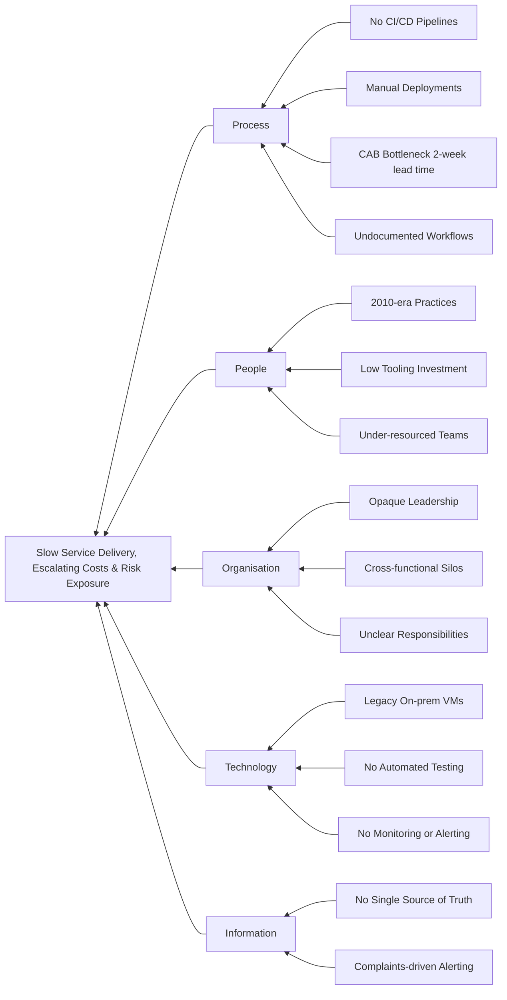

# Business Analysis Methodology <!-- 800 words -->

We've framed the problem using CATWOE to understand the competing stakeholders world views and inform a problem statement. DORA shows us what measurable success looks like against a software delivery maturity model which feeds into out smart goal.

However, we still need to analyse the problem further and deliver the solution. 

## Analysis Models

<!--
Table Section: Analysis Models (~600 words)
POPIT Model and Fishbone Diagram analysis summaries

This section should:
●  Apply business analysis tools to understand the problem.
●  Use POPIT Model to analyze People, Organization, Process, Information, Technology.
●  Apply Fishbone Diagram to identify root causes.
●  Evaluate a range of potential tools and approaches, and justify your choice.
-->

### POPIT Model

POPIT (People, Organisation, Process & Information Technology) can help us decompose the CATWOE perspective into operational dimenstions. What we've found by conductingin interviews with staff and reviewing technology against best practivce has uncovered the following in each area.

#### Processes

Developers report that processes are not well documented, coding standards are lacking and the development workflow is inconsistent. Formerly, mainly because a lot of the solutions were delivered by third-parties, CI/CD pipelines don't even exist for deployments. Application changes go through two process gates - DDA (TODO: What the hell is this?) and then to the CAB (Change advisory board) however this effectively introduces a 2 week leadtime into any changes.

In this organisation the CAB is a huge sticking point. While the CAB sits on top of ITIL (IT Infrastructure Library) framework it's the v3 model from 2007 (now nearly 20 years old) that doesn't take into account ITIL v4 (2019) advances like DevOps, automated change approvals and decentralised decision making. (Williams, 2025)

At the moment developers need to create a document for DDA (takes 2-4 people a week) and then another one tailored towards risk for the CAB which pulls 10-20 people into a one hour meeting every week.

Additionally some interviewees argued that the CAB is operating under misconceptions (ManageEngine, n.d.) including: 

> "all changes must go to the CAB and that changes can only be implemented if the CAB agrees". 

#### Organisation

Based on my experience so far within the project the technical leadership structure is opaque and hard to navigate. It's not entirely clear who is responsible for what realm and finding out consists of asking team members who to talk to rather than being able to look it up. 

Any time an issue arises that might be cross-functional or require sharing knowledge to address a problem things start to break down and it can be difficult to find someone to drive the work towards a solution.

#### People

The council culture associated with 'technical best practice' sits within the 2010-2019 era of segregated responsibilities and on-prem manual deployments. While people would obviously like to do better the investment in tooling and support just hasn't materialised. 

This further suggests that providing a platform (IDP) that follows best practices and security would support development team members to embrace newer ways of working. Introducing Agile, TDD and CI/CD as some of the foundations of iterative and faster service delivery (see DORA findings around high performing organisations: Forsgren, Humble and Kim, 2018) would certainly empower teams to feel more confident in their abilities.

#### Information and Technology

Currently services and applications live on virtual machines hosted on premise which are not properly monitored or maintained. This also hampers operational security because there is no single source of truth about the performance of applications that serve the public. Organisations should find out about service outages via customer complaints.

There are virtually no automated CI/CD (continuous improvement/continuous delivery) pipelines to support rapid change across the estate. This is another factor suppoting the proposal to deliver an Interal Development Platform that includes monitoring and automated testing as part of the feature set. 

Introducing automated deployment pipelines deploy first to a dev, then a test and finally a production environment results in being able to confidently ship new features or quickly roll back to a more stable version if an issue appears.

<!-- 

Processes 
Are development processes well-documented?
Have coding standards and deployment procedures been clearly communicated?
Do teams follow consistent development workflows?
Are CI/CD pipelines properly configured and maintained?
Are there any technical workarounds being used that indicate process gaps?

Organisation
What is the technical leadership and governance structure?
Do development teams collaborate effectively across different technical domains?
Is there a clear technical strategy aligned with business goals?
Are technical roles and responsibilities clearly defined?

People 
Do developers and technical staff have the skills they need?
Are teams motivated and engaged with the technical direction?
Are technical stakeholders involved appropriately in system changes?
Do users understand how to effectively use the software systems?

Information and Technology 
Do systems provide the data and functionality needed for operations?
Do technical teams have access to proper monitoring and debugging information?
Are systems scalable, secure, and maintainable?
Do systems integrate effectively with each other?

-->

### Fishbone Diagram Analysis

We can illustrate the causal factors behind the current state. The root causes (grouped by POPIT category) feed into the [problem statement](1_business_case.md#problem-analysis--problem-statement) established in Section 1: *slow service delivery, escalating costs and exposure to risk.*

_Figure 2: Underlying causes of the current state_

It should now be clear that a change in software development methodology, tooling and associated processes will address the problem. 

## Methodology

In some ways the decision about which Software Development Life Cycle approach to adopt has already been made for us since we're following the guide laid out by the DORA research and Accelarate. 

> Continous delivery, lean management and a culture of experimentation drive performance.

The IDP is effectively a product that will enable the teams to improve the metrics which predict that the goal wil be met. With this in mind we need a flexible approach which can adapt to circumstances which is where Agile shines.

According to the same research other approaches (waterfall, SAFe, ITIL) are too cumbersome. 

Waterfall has long feedback loops, excessive up-front planning and big bang releases after a long implementation process.

SAFe (scaled agile framework) contains too much bureaurocratic overhead without contributing much to the outcome.

ITIL (as we've already mentioned) correlated to works outcomes, delays from relying on a CAB and other issues from using this in place of automated testing and deployments.

The reason to go with Agile as an SDLC approach is because according to the DORA analysis consisting of multi-year developer surveys and the results summarised in the book Accelerate, it simply produces the best outcomes over other approaches.

### Tool choices

Since Azure is the cloud hosting platform being used by the council it's logical to keep to tools that Microsoft support. 

We could use Jira, Slack, Github and so on but merging these into a single source of truth to capture the metrics needed to measure progress within the project would result in an additional set of integration work.

Paying for a diverse set of tools, even though developers might prefer Slack over Teams, or Gihub actions over Azure DevOps pipelines just results in a higher per-user cost. 

Choosing Azure DevOps means we get integrated access to CI/CD pipelines that can easily connect to Entra ID (user management) and cloud resources in Azure as well as Git repositories, user story creation linked to feature branches in code. 

Dashboards can also be created inside Azure DevOps because of the integrated nature of all these tools to show exactly how teams are performing against the DORA metrics which are predictors for software transformation excellence.

<!-- 
Table Section: Methodology (~400 words)
SDLC, Project Management methods (Agile/Waterfall/Hybrid), and Kanban/JIRA

This section will explain the business analysis approach you will take, and the business analysis tools you will use.  
 
You will evaluate a range of potential tools and approaches, and justify your choice.

This section should:
●  Explain the business analysis approach you will take.
●  Evaluate SDLC approaches.
●  Compare project management methods (Agile, Waterfall, Hybrid).
●  Justify your choice of methodology.
●  Explain tools like Kanban/JIRA and why you will use them.

Note: Total table allocation is 1000 words (600+400), but this file has 800 word limit from original brief.
-->

### SDLC

### Project Management Methods

#### Agile

#### Waterfall

#### Hybrid

### Tools

#### Kanban/JIRA

<!--
RUBRIC C:
Describes basic application of business analysis methodologies with foundational competence.
Engages in modest research, utilising some professional and academic sources to inform practice and slightly extend software development knowledge.

RUBRIC B:
Explains and applies business analysis methodologies effectively.
Conducts research that incorporates relevant professional and academic sources to inform best practices and contribute to software development knowledge.

RUBRIC A:
Strategically integrates business analysis methodologies.
Conducts extensive research from a variety of professional and academic sources to effectively inform best practices and significantly extend software development knowledge within the organisation.
-->