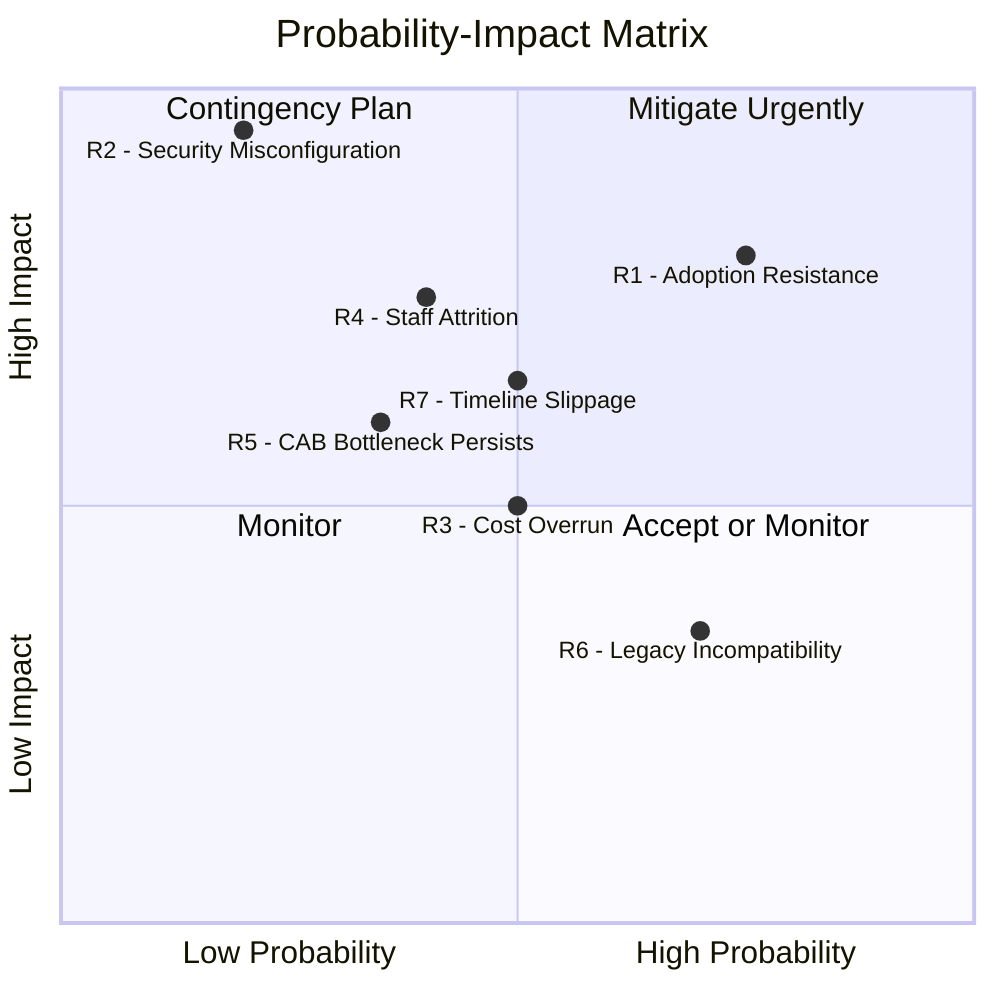

# Risk Management Plan <!-- 600 words -->

<!-- 
Table Section: Risk Management (~450 words)
Risk Assessment, treatment strategies, and Probability-Impact summary

This section should contain a risk assessment and mitigation plan.
These risks may include potential issues with budget, quality, scope, 
scheduling and more.

This section should:
●  Contain a risk assessment and mitigation plan.
●  Identify risks including potential issues with budget, quality, scope, scheduling and more.
●  Develop treatment strategies for identified risks.
●  Create a Probability-Impact matrix to prioritize risks.
●  Aim to assure stakeholders that the project can be managed and monitored.

Note: Table allocation is 450 words, but this file has 600 word limit from original brief.
-->

## Risk Assessment

There are several risk domains that need to be managed when building the IDP.

### Human Centered Risk

Fundamentally, if the various stakeholders don't buy into the goal and the strategies required to implement the IDP it's unlikely to succeed. 

Whether it's lack of engagement or worse, active sabotage to undermine the project, participants need to be educated as to why the change is needede.

Offering support and training is another way to increase the confidence of the participants that they can 

### Project Risk

As the project proceeds executive sponsors will likely be focussed on progress against a number of milestones. The project delivery team need to be very open and transparent when it comes to communicating about implementation time, savings, costs and delivering business value. 

A executive isn't going to be particularly interested in the deep technical reasons why something does or doesn't work (yet) but they are going to notice that the feature which was supposed to be live at month end is delayed. 

Appointing a dedicated project manager who is responsible for communication around milestones and co-ordinating reviews is mandatory. 

If the executive team starts to perceive the IDP delivery is slipping over budget or burning time they might start interfering, micro-managing or withdraw support from the project.

Similarly, when processes (like the CAB) are de-prioritised those who were previously heavily invested in being part of the governance might feel threatened by their role diminishing. 

### Technical Risk

Technical risks are actually the least troublesome. 

Most challenges can be overcome unless the implementation team is under ridiculous externally imposed time pressure. 

Following the Agile methodology should give developers the un-interrupted time needed to focus on delivering business value in sprint increments.

The challenge for project management is to translate the work in progress into features that the business can grasp the value of.

## Treatment Strategies

### Risk Treatment Strategies

| ID | Risk | Probability | Impact | Strategy | Treatment |
|---|---|---|---|---|---|
| R1 | Teams resist adopting new platform and revert to manual processes | High | High | **Mitigate** | Onboard pilot teams with pair-programming and embed platform engineers; early wins build confidence and create internal advocates (POPIT People). |
| R2 | Hub/spoke networking or Entra ID misconfiguration exposes tenant to breach | Low | Critical | **Mitigate** | Policy-as-code enforced at subscription creation; Defender for Cloud baselines; peer-reviewed Terraform modules. Aligns with BIA security findings (Booth, 2025). |
| R3 | Azure consumption costs exceed CBA estimate | Medium | Medium | **Mitigate** | Budget alerts, cost management dashboards and tagging policy enforced via platform-core; monthly spend reviews with finance. |
| R4 | Platform engineers leave or are reassigned mid-delivery | Medium | High | **Mitigate** | Document all platform-core modules; ensure at least two engineers can operate every Tier 1–2 component; IaC as living documentation reduces bus factor. |
| R5 | CAB process is not reformed and continues to bottleneck automated deployments | Medium | High | **Transfer** | Escalate to programme sponsor (CATWOE Owner); present DORA evidence that automated change approvals outperform manual CAB review (Williams, 2026). Risk ownership sits with governance, not the delivery team. |
| R6 | Legacy applications cannot be containerised or adapted to CI/CD pipelines | High | Medium | **Accept** | Acknowledged in MoSCoW as a Won't-have; legacy migration is a subsequent programme. Platform proves value with greenfield and low-complexity services first. |
| R7 | 12-month SMART goal timeline proves insufficient for three team onboardings | Medium | Medium | **Mitigate** | Agile delivery with two-week sprints allows scope adjustment; MoSCoW Could-haves are descoped first; DORA dashboard provides early visibility of slippage. |

## Probability-Impact Summary

<!--
RUBRIC C:
Applies basic knowledge to identify some constraints and risks with limited detail.
Occasionally acknowledges trends, using them to inform partial integration of best practices.

RUBRIC B:
Explains and analyses key constraints and risks.
Develops a project plan with consistent integration of best practices, showing awareness of current trends and innovations.

RUBRIC A:
Thoroughly evaluates constraints and risks, crafting a detailed plan that addresses them effectively.
Consistently applies best practices informed by up-to-date trends, showing how teams leverage innovations in development.
-->