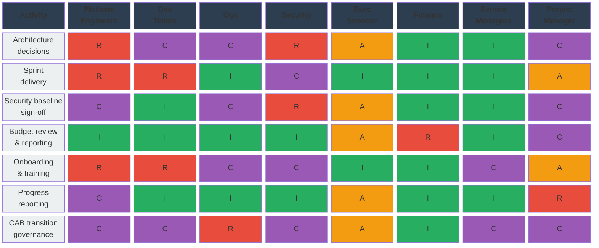

# Communication Plan <!-- 800 words -->

One issue identified in this project is a lack of a singular tool for managing both stakeholders, development teams and communications. In reality, stakeholders want a high level plan in powerpoint, risks end up in Excel and development tasks are recorded in Azure DevOps.

This lack of a singular platform adds complexity and friction around communications, progress and expectation management.

Project Managers should educate themselves to use Azure DevOps Boards, Dashboards and Wiki pages as the single vehicle for communicating progress. This also increases transparency given that all the information about the project exists in one location rather than being spread across multiple sources.

## Stakeholder Analysis & tailored communications

Splitting the stakeholders across the CATWOE Actor/Owner distinction results in:

| Technical (Actor) | Non-Technical (Owner) |
| ----------------- | --------------------- |
| Platform Engineers | Executive Sponsor |
| Development Team(s) | Finance |
| Operations / Support | Service Owners |
| Security | Project Managers |

<!-- markdownlint-disable MD001 -->
#### Table 3: Stakeholder Actor/Owner categorisation using CATWOE
<!-- markdownlint-enable MD001 -->
Having done a practice presentation to my immediate team their feedback was that for an internal 'show and tell' type meeting to non-technical staff the presentation should focus on the improved business outcomes, not the technical implementation.

<!--
Table Section: Stakeholder Analysis (~350 words)
Identification, Categorization (Power-Interest), and RACI summary

This section will identify and analyze the stakeholders involved in the project.

This section should:
●  Identify and analyze the stakeholders involved in the project.
●  Categorize stakeholders using Power-Interest Grid.
●  Create a RACI matrix (Responsible, Accountable, Consulted, Informed).
●  Distinguish between technical and non-technical stakeholders.
-->

An Actor/Owner split also reflects a Power-Interest categorisation: Owners (Executive Sponsor, Finance) hold high power and require managed, outcome-focused communication, whereas Actors (Platform Engineers, Developers) hold high interest in implementation detail and need frequent, technically rich engagement.

Technical actors workshop architecture decisions, discuss authentication models, design deployment pipelines, choose solution components through asynchronous and technically dense wiki pages, code reviews and submit proposals for comment.

Executive buy-in demands a clear communication of results in terms of concrete savings, security improvements and service delivery. Tailoring our message to the audience is key.

### RACI Summary

### Table 4: RACI matrix assigning responsibility across the stakeholders

We can use this matrix to guide the persuasion and communication steps since this illustrates tensions between various groups.

Taking Security as an example, the Security team is responsible for the topic and the Executive team is accountable if there's a breach but Platform Engineering, Project Management and Ops need to be consulted because they're most likely to be implementing the solution Security proposes.

The tension in this case might well arise between timeframes (Executive requirements), best practice (as proposed by the Security team) and what's practical to implement given the time & expertise of the Platform team.

Competing perspectives like this at the implementation phase reflect back to the CATWOE framework where each stakeholders worldview needs to be managed by the Project Manager, as well as the work itself.

## Persuasion & Communications

The key Project Manager role has two difficult tasks. Managing the project progress itself and communicating out to stakeholder groups.

We have a selection of audiences with different worldviews so using a single Minto Pyramid which offers of a conclusion and supporting arguments is too homogenous for our situation.

ELM helps diagnose how each group processes information while Ethos/Pathos/Logos can be used to persuade stakeholders by talking from the viewpoint that they're interested in.

<!-- 
Table Section: Persuasion & Comms (~350 words)
Minto Pyramid, ELM, and Ethos/Pathos/Logos strategies

It should aim to highlight the strategy, purpose, method, and 
frequency you plan to communicate with and engage different groups 
of technical and non-technical stakeholders.

This section aims to show your project through a range of narrative 
lenses, such as how you would report the project through an impact 
story.

This section should:
●  Highlight the strategy, purpose, method, and frequency you plan to communicate with different groups of stakeholders.
●  Apply Minto Pyramid Principle for structured communication.
●  Use ELM (Elaboration Likelihood Model) to understand persuasion routes.
●  Apply Ethos (credibility), Pathos (emotion), Logos (logic) strategies.
●  Show your project through a range of narrative lenses, such as how you would report the project through an impact story.

Note: Total table allocation is 700 words (350+350), but this file has 800 word limit from original brief.
-->

### ELM (Elaboration Likelihood Model)

ELM has two processing routes: **central** (audience is motivated and able to scrutinise arguments) and **peripheral** (audience relies on cues such as credibility, brevity or emotional resonance).

The CATWOE worldview analysis from [Section 1](1_business_case.md#problem-analysis--problem-statement) maps naturally onto these routes.

Technical stakeholders (Platform Engineers, Developers, Security, Operations) process via the **central route**. Their worldview centres on technical debt, security posture and implementation feasibility — they will interrogate claims and require evidence such as architecture diagrams, DORA metrics and test results.

Communication with these groups should therefore be frequent (daily stand-ups), detail-rich and structured around technical artefacts in Azure DevOps.

Non-technical stakeholders (Executive Sponsor, Finance, Service Managers) process via the **peripheral route**. They are pressed for time, manage competing priorities, and assess proposals through cues — the credibility of the presenter, headline cost/benefit figures and dashboard summaries.

Communication should be less frequent (weekly or biweekly), concise and framed around business outcomes rather than implementation detail.

This distinction directly informs the Ethos/Pathos/Logos strategy below: central-route audiences respond to logos (evidence), while peripheral-route audiences are more effectively engaged through ethos (credibility) and pathos (impact on services and community).

### Ethos/Pathos/Logos Strategies

We can refer to the Ethos/Pathos/Logos strategies regularly to remind and persuade stakeholders why we're carrying out the transformation and to keep them engaged emotionally.

* We want to adopt best practices for service delivery as a credible organisation (ethos)
* Which will enable us to better serve our community with services that will enhance their lives (emotion, pathos)
* Failing to do so will lead to increased security risk and make future changes and features harder to implement (logic, logos)

Some groups only need a bi-weekly progress update since they're interested in the big picture. This would be the Executive and Finance Teams who measure progress against business outcomes, not technical ones.

Security and other stakeholders responsible for architecture (operations) require a weekly update where various implementation teams are so that technical decisions aren't made in opposition to their interests.

Platform Team members and Developers run Agile process daily stand-ups so any issues and blockers can be identified and overcome quickly.

The Project Managers role is to communicate issues/timescales/delays upwards as well as facilitate in helping them overcome issues or get guidance from Security or Executive Team members if there happen to be competing priorities.

Both the implementation and Executive/Finance teams will likely need reminding about the (SMART) goal, the timescales and the eventual payoff from achieving this.
<!--
RUBRIC C:
Applies communication strategies effectively, though with some clarity issues.
Occasionally utilises leadership principles.

RUBRIC B:
Explains and justifies effective communication strategies, applying leadership principles.
Understands communication's impact on stakeholder engagement.

RUBRIC A:
Analyses and evaluates sophisticated communication methods, proposing innovative solutions.
Consistently applies leadership principles and professional standards.
-->